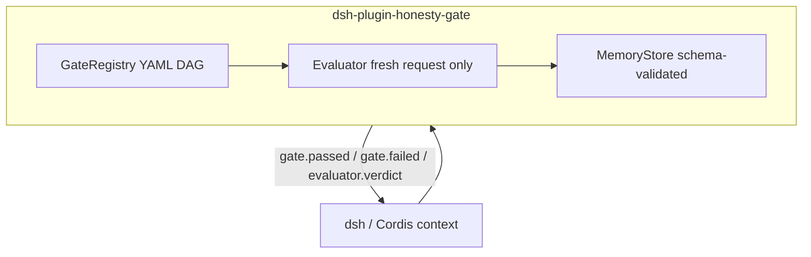

# dsh-plugin-honesty-gate

Ports Meridian’s Generator / Evaluator separation, mechanical gates, and validated memory into a [DeepSeek Harness](https://github.com/deepseek-ai/deepseek-harness) / Cordis plugin.

**Status:** Phase 3 — hello plugin + GateRegistry + Evaluator + memory

Built on Meridian’s gate + independent Evaluator contracts. This increment is a loadable **bundle** plus a standalone GateRegistry and a fresh-context Evaluator that returns [portfolio-kit](https://github.com/PCSchmidt/portfolio-kit) verdict JSON. It does not boot a full dsh process.

## Relation to Meridian

Meridian remains the source of primitives ([PCSchmidt/meridian](https://github.com/PCSchmidt/meridian)). This repo **re-implements the same contracts** inside dsh. It does not fork a second gate language.

Local dsh reference checkout (sibling, not a dependency): `../deepseek-harness` @ `dsh-v0.1.0-rc.8` (`141eb6f`).

## Shared contracts

- [GATE_CONTRACT.md](https://github.com/PCSchmidt/portfolio-kit/blob/main/docs/GATE_CONTRACT.md)
- [EVAL_RUBRIC_TEMPLATE.md](https://github.com/PCSchmidt/portfolio-kit/blob/main/docs/EVAL_RUBRIC_TEMPLATE.md)
- [MEMORY_SCHEMA.md](https://github.com/PCSchmidt/portfolio-kit/blob/main/docs/MEMORY_SCHEMA.md)
- [DATA_POLICY.md](https://github.com/PCSchmidt/portfolio-kit/blob/main/docs/DATA_POLICY.md)
- Verdict schema: [schemas/evaluator-verdict.schema.json](schemas/evaluator-verdict.schema.json) (copy of portfolio-kit 0.1.0)

## Architecture



`tools/pre-execute`: if the current required gate fails mechanically, return `{ kind: 'deny', reason }` without calling `next()`.

`advance(gateId)`: mechanical `verify` must exit 0 **and** Evaluator verdict must not be `fail`.

## Fresh-context Evaluator

`Evaluator.evaluate(request)` accepts only:

- `gate`, `session_id`
- `artifacts[]` (`path` + `content` or `missing`)
- `contract`, `spec`, `gate_spec`

Generator fields (`chat_history`, `generator_self_score`, …) are **dropped** before judging. Default judge is mechanical and adversarial (no API key). An optional `judge` callback may supply scores; they are still schema-validated and praise-stripped.

Verdict rules (portfolio-kit / Meridian):

| Condition | Verdict |
|-----------|---------|
| `overall >= 7.0` and no high-severity issues | `pass` |
| `overall >= 5.0` and no high-severity issues | `warn` |
| `overall < 5.0` or any high-severity issue | `fail` |

Weights: completeness 0.30, quality 0.25, consistency 0.20, spec_adherence 0.25.

## Memory (portfolio-kit 0.1.0)

Default store: `<workspace>/.honesty-gate/memory/` (gitignored).

| File | Rule |
|------|------|
| `semantic.json` | Patterns; SHA-256 hash dedupe; `validated_count` bump |
| `episodic.jsonl` | Append-only `session_start` / `gate_passed` / `gate_blocked` / … |
| `corrections.jsonl` | Append-only reflexion; hours optional |

Invalid writes throw `MemoryError` and do not persist. `revertLast()` undoes the most recent write (reversible effect). `advance()` records `gate_passed` or `gate_blocked`. `remember()` / `reflect()` are the public semantic and correction writers.

## What is implemented

| Piece | Behavior |
|-------|----------|
| `apply(ctx)` | Cordis hello plugin; `ctx.honestyGate` |
| `GateRegistry` | YAML DAG, cycles, `artifacts_exist` / `tests_exist` |
| `Evaluator` | Fresh-context verdict JSON |
| `advance` | Mechanical verify + Evaluator fail-closed |
| `MemoryStore` | semantic.json + episodic.jsonl + corrections.jsonl |
| Bundle | `dsh.bundle` + [cordis.patch.yml](cordis.patch.yml) |

Not yet: live `dsh plugin add` against a running profile, LLM judge.

## Develop

```sh
npm install
npm test
```

Requires Node.js 20+. Tests use `node:test` and do not start dsh.

## Install as a dsh bundle (when `dsh` is on PATH)

```sh
dsh plugin --profile honesty-gate-demo add .
dsh --profile honesty-gate-demo --dump-config
```

## Planned phases

1. Clone dsh; Cordis hello plugin; GateRegistry + mec
3. Schema-validated semantic / episodic / corrections memory *(this increment)* increment)*
3. Schema-validated semantic / episodic / corrections memory
4. Profile/bundle polish, eval harness, `dsh-plugin` topic

## Public / unclassified data only

No JPO, F-35, or other non-public program data.

## Current tree

```
index.js
src/plugin.js
src/gate-registry.js
src/evaluator.js
src/memory-store.js
schemas/evaluator-verdict.schema.json
schemas/memory-
schemas/evaluator-verdict.schema.json
cordis.patch.yml
examples/
tests/
```

