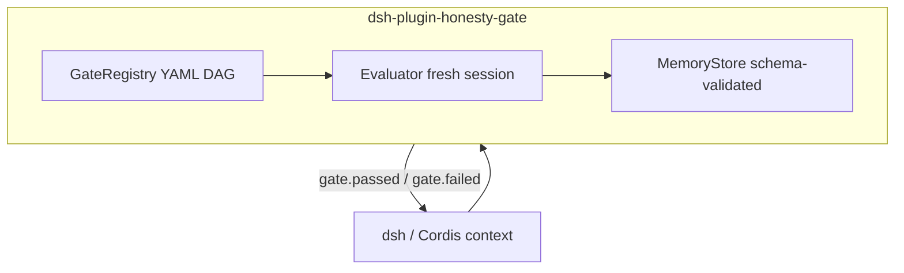

# dsh-plugin-honesty-gate

Ports Meridian’s Generator / Evaluator separation, mechanical gates, and validated memory into a [DeepSeek Harness](https://github.com/deepseek-ai/deepseek-harness) / Cordis plugin.

**Status:** Scaffolding – Phase 0

Built on Meridian’s gate + independent Evaluator contracts. This is the highest-leverage external contribution in the family: the same reliability properties, expressed as Cordis services, waterfall hooks, and reversible effects.

## Relation to Meridian

Meridian remains the source of primitives ([PCSchmidt/meridian](https://github.com/PCSchmidt/meridian)). This repo **re-implements the same contracts** inside dsh. It does not fork a second gate language.

## Shared contracts

This project follows [portfolio-kit](https://github.com/PCSchmidt/portfolio-kit):

- [GATE_CONTRACT.md](https://github.com/PCSchmidt/portfolio-kit/blob/main/docs/GATE_CONTRACT.md)
- [EVAL_RUBRIC_TEMPLATE.md](https://github.com/PCSchmidt/portfolio-kit/blob/main/docs/EVAL_RUBRIC_TEMPLATE.md)
- [MEMORY_SCHEMA.md](https://github.com/PCSchmidt/portfolio-kit/blob/main/docs/MEMORY_SCHEMA.md)
- [DATA_POLICY.md](https://github.com/PCSchmidt/portfolio-kit/blob/main/docs/DATA_POLICY.md)

## Architecture

Planned hooks: `tools/pre-execute`, `agent/request`, optional `llm/stream` abort. Failures abort or force remediation. Memory writes are reversible effects.

## Planned phases

1. Clone dsh from source; Cordis tutorial; hello plugin
2. GateRegistry + one mechanical pre-condition
3. Independent Evaluator service + structured JSON verdict
4. Schema-validated semantic / episodic / corrections memory
5. Installable plugin, example profile/bundle, eval harness, `dsh-plugin` topic

## Public / unclassified data only

No JPO, F-35, or other non-public program data. See the kit data policy.

## Current tree

Phase 0 is documentation only. Implementation starts after portfolio-kit is the published contract source.
